<div align="center">



<br>

[](https://github.com/Niloy-Bhuiyan/leadbridge/actions/workflows/ci.yml)
[](./service/tests)
[](https://www.python.org/)
[](./workflows)
[](./service/app/crm/hubspot.py)
[](./LICENSE)

<br>

**An enquiry arrives. Something has to clean it up, check whether it has been seen before,<br>
work out what the person actually wants, file it in the CRM, and — if they left a website —<br>
audit that site and attach the findings to their record, before anyone picks up the phone.**

<br>

</div>

---

## The pipeline

<div align="center">

</div>

**n8n owns orchestration** — scheduling, branching, retries, fan-out, and the visual record of
what ran. Those are the things an agency needs to change without a deploy.

**The Python service owns logic** — normalization, deduplication, provider fallback, the audit
rules. Those need tests, a diff history, and review. Thirty chained Code nodes would be
unreviewable.

The seam between them is plain HTTP with a shared secret.

---

## Verified end to end

Not "should work" — this is an actual recorded run against a live HubSpot portal.

```text
POST /leads/pipeline  (run 1)
  normalize    ok            0ms
  dedupe       ok            0ms
  classify     degraded      0ms     offline rules, labelled as such
  crm          ok         3283ms     contact 555145505504 created + triage note
  seo_audit    degraded    957ms     octopi-digital.com → 93/100, 2 findings
  → status: completed

POST /leads/pipeline  (run 2, byte-identical)
  → status: skipped_duplicate   matched_on: fingerprint
  → contact: null               no second contact created

GET /ops/runs
  {"leads": 1, "runs_by_status": {"completed": 1, "skipped_duplicate": 1}}
```

That second run is the whole idempotency guarantee in one check: a retried webhook must never
create a duplicate contact.

The audit also produced a real finding on the site it was pointed at — **639 of 719 images
with no alt text** — which is the kind of thing this is for.

---

## Quick start

Runs fully offline with no accounts and no API keys. Every integration degrades to a
labelled fallback.

<details open>
<summary><b>With Docker</b> — everything, one command</summary>

<br>

```bash
git clone https://github.com/Niloy-Bhuiyan/leadbridge
cd leadbridge
cp .env.example .env
docker compose up --build
```

</details>

<details>
<summary><b>Without Docker</b> — Python 3.11+ and Node 18+</summary>

<br>

Two terminals.

```bash
# terminal 1 — the service
cd service
pip install -e ".[dev]"
python -m uvicorn app.main:app --port 8000
```

```bash
# terminal 2 — n8n
npx n8n
```

`.env` is read from the repo root and from the current directory, so it works either way.

</details>

<br>

Then:

1. Open n8n at <http://localhost:5678> and create the local owner account.
2. **Workflows → Import from File** → `workflows/lead-intake.json`
3. Open it and click **Execute workflow** to arm the test webhook.
4. Send a lead:

```bash
curl -X POST http://localhost:5678/webhook-test/leadbridge-intake \
  -H 'Content-Type: application/json' \
  -d '{"email":"ayesha@example-client.com","name":"AYESHA RAHMAN","company":"Example Client Ltd.","phone":"01868686062","website":"example.com","message":"We need a CRM automation workflow and an SEO audit."}'
```

Then look at what actually happened:

```bash
curl -s http://localhost:8000/ops/availability | python -m json.tool   # which integrations are live, and why not
curl -s http://localhost:8000/ops/runs         | python -m json.tool   # every run, every step, every duration
```

Interactive API docs at <http://localhost:8000/docs>.
[**RUNBOOK.md**](./RUNBOOK.md) covers HubSpot setup and a failure playbook.

---

## The four rules

Most of the comments in this codebase exist to mark where one of these applies.

<table>
<tr><td width="26%"><b>Nothing is fabricated</b></td>
<td>A step that did not run is <i>absent</i> from the run log, not recorded as zero.
PageSpeed metrics that were not returned are <code>available: false</code> with a reason,
never a default number. The offline classifier stamps every result with
<code>provider: "mock"</code> and <code>degraded: true</code>.</td></tr>

<tr><td><b>Misconfiguration must be visible</b></td>
<td><code>/ops/availability</code> reports every known provider, whether it could run, and why
not — <i>including</i> providers that configuration has ruled out. "The integration I expected
is missing" is never the answer. <code>/ops/health</code> reports <code>auth: open</code> when
the shared secret is unset.</td></tr>

<tr><td><b>Degrade where safe, fail where not</b></td>
<td>A failed LLM call falls back to offline rules and marks the run degraded — a worse summary
is survivable. A failed <b>CRM write is raised</b>, never absorbed: a lead believed filed but
not filed is the worst outcome in the system, so n8n routes it to a human. A failed audit never
loses the lead.</td></tr>

<tr><td><b>Untrusted input stays data</b></td>
<td>The lead message is attacker-controlled — anyone can type "ignore your instructions" into a
contact form. It is fenced, labelled untrusted, and every instruction lives in the system
prompt. <code>test_providers.py</code> asserts that boundary holds.</td></tr>
</table>

---

## What is real, and what is not

Stated plainly, so nobody has to read the source to find out.

<details open>
<summary><b>Real and running</b></summary>

<br>

- **127 passing tests** — normalization, all three dedupe layers, retry/backoff semantics,
  HubSpot request shapes, SEO parsing and scoring, provider fallback, and the API end to end.
  Hermetic: credentials are blanked for every test, so the suite behaves the same on your
  machine as in CI.
- **HubSpot v3 client** — search-then-write upsert, 409 race recovery by parsing the id out of
  the error body, note-to-contact association. Verified against a real portal (above).
- **Technical SEO audit** — robots.txt parsing including site-wide-block detection, sitemap
  discovery and counting, title/meta/canonical/H1/JSON-LD/Open Graph/alt-text extraction, and
  Core Web Vitals from PageSpeed Insights with CrUX **field** data preferred over lab data.
- **Retry layer** — full-jitter exponential backoff, `Retry-After` honoured and clamped, and
  deliberately *no* retry on a non-429 4xx, because a 401 will not fix itself.
- Idempotency via content fingerprint, an append-only SQLite run log, and `/ops` endpoints.
- Both n8n workflow graphs, validated in CI.

</details>

<details>
<summary><b>Not done, and not claimed</b></summary>

<br>

- **No outbound email is sent.** The classifier drafts a first reply; nothing delivers it, and
  the CRM note says "not sent automatically" so nobody assumes otherwise.
- The audit reads **one URL** — the one submitted. It is not a site crawler.
- The **score is a deduction model, not a ranking prediction.** It counts known problems.
  Quoting it as an SEO forecast would be wrong.
- No multi-tenancy, no user accounts, no dashboard.
- `intent` and `priority` are a triage aid for a human, not a decision.

</details>

---

## Layout

```text
workflows/              n8n exports — lead intake, and a weekly scheduled audit
service/app/
  normalize.py          email · BD phone → E.164 · website · fingerprint · fuzzy key
  dedupe.py             three layers: fingerprint, email, fuzzy company|name
  db.py                 SQLite lead store + append-only run log
  http.py               one retry/backoff policy for every outbound call
  providers/            Anthropic + offline mock, behind one protocol
  crm/                  HubSpot + in-memory twin, behind one protocol
  seo/                  robots · sitemap · on-page · PageSpeed · rules engine
  pipeline.py           single-call path, sharing the same stage functions
  routers/              leads · seo · ops
service/tests/          127 tests, fully offline
scripts/                workflow graph validator · committed-credential scanner
```

---

## Tests and checks

```bash
cd service && pip install -e ".[dev]" && pytest -q
```

No network, no keys — a test that reached the internet would fail rather than pass quietly.

```bash
python scripts/validate_workflows.py   # n8n graph consistency
python scripts/check_no_secrets.py     # no credentials in tracked files
```

The credential scanner exists for one specific hazard: an n8n workflow exported after a token
was typed into an HTTP node carries that token in the JSON. These workflows reference `$env`
instead, and CI keeps it that way. It scans **tracked** files only — a real gitignored `.env`
holding a real token is correct and is not flagged, because a scanner that cries wolf is a
scanner people switch off.

---

## Security

- Both containers bind to `127.0.0.1`. The service holds the HubSpot token, so it is not
  network-reachable merely because n8n needs to call it — n8n reaches it over the compose
  network.
- Every mutating endpoint sits behind `X-Leadbridge-Secret`. `/ops` stays readable without it,
  deliberately: whoever is diagnosing a misconfiguration is usually the person who has lost
  access to the configuration.
- The service container runs as a non-root user; the database lives on a volume.
- `.env` is gitignored; `.env.example` documents every variable and contains no values.

---

<div align="center">

### Provenance

Built by **[Nurul Azam Bhuiyan](https://github.com/Niloy-Bhuiyan)** as a working study of agency
automation: n8n orchestration, CRM integration and technical SEO auditing.
A personal project, not client work — the commit history shows when it was written.

The deduplication approach is adapted from the job-listing ingestion pipeline in
**[Shuru](https://github.com/Niloy-Bhuiyan/shuru)**; the provider-with-offline-mock pattern is
the one used in **[IncidentLens](https://github.com/Niloy-Bhuiyan/IncidentLens)** and
**[Agent-Paw](https://github.com/Niloy-Bhuiyan/Agent-Paw)**.

<sub>MIT licensed</sub>

</div>
